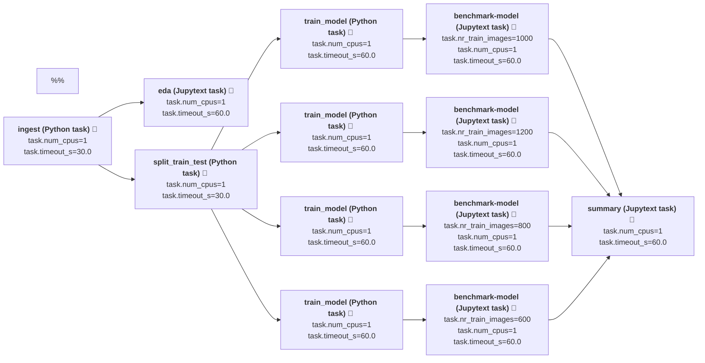

# `mnist-digits-demo-pipeline`

This repository contains a demo machine learning pipeline implemented using the [Composable Logs](https://github.com/composable-logs/composable-logs) framework.

This demo pipeline:
 - trains a model for predicting digits 0, ..., 9 from a handwritten image of the digit. The data is a small data set included in sklearn library.
 - runs daily using Github actions, but does not require any other cloud infrastructure. Rather it uses:
    - **Github Actions:** orchestration and compute
    - **Github Build Artifacts:** to persist pipeline run results (using the OpenTelemetry open standard)
    - **Github Pages:** static website for model/experiment tracking, [demo site](https://composable-logs.github.io/mnist-digits-demo-pipeline/). This is built using custom fork of MLFlow.
 - development is supported by both CI automation and local development tools.
    - This repository is configured to run the pipeline for all pull requests, see experiment tracking site linked above.
    - Local development with VS Code and/or Jupyter notebooks.

**For more details, please see the main [documentation site](https://composable-logs.github.io/composable-logs/).**

### ML pipeline tasks



As seen from the descriptions, the tasks include both pure Python and Jupytext (notebook) steps.

Alternatively, a pipeline's full output, can be inspected by downloading a zip build artefact for a recent build, [link](https://github.com/composable-logs/mnist-digits-demo-pipeline/actions/workflows/ci.yml). The zip files contain rendered notebooks, logged metrics and images and the trained model(s) in ONNX format.

## Ways to run the pipeline
### (1) Run as part of repo's automated CI pipeline

This repository uses Github Actions automation to run the demo pipeline as part of the repo's CI-pipeline. Each CI-run stores the pipeline outputs (ie notebooks, models, and logged images and metrics) as build artefacts.

This means:
- The entire pipeline is run for all commits to pull request to this repository, and to commits to `main`-branch.
- From the build artefacts one can inspect the pipeline's outputs (and, in particular, model performances) for each pull request and commit.
- The pipeline runs using (free) compute resources provided by Github. No other infrastructure is needed.
- Forking this repo in Github gives a new pipeline with its own experiment tracker that can be developed independently.

The below diagram shows a Gantt chart with runtimes of individual pipeline tasks.

```mermaid
gantt
    %% Mermaid input file for drawing Gantt chart of runlog runtimes
    %% See https://mermaid-js.github.io/mermaid/#/gantt
    %%
    axisFormat %H:%M
    %%
    %% Give timestamps as unix timestamps (ms)
    dateFormat x
    %%
    section ingest (Python task)
    1.34s - OK : , 1675605494 , 1675605496
    section eda (Jupytext task)
    15.86s - OK : , 1675605496 , 1675605512
    section split_train_test (Python task)
    1.39s - OK : , 1675605497 , 1675605499
    section train_model (Python task)
    5.16s - OK : , 1675605499 , 1675605504
    section train_model (Python task)
    7.09s - OK : , 1675605502 , 1675605509
    section train_model (Python task)
    4.24s - OK : , 1675605502 , 1675605506
    section train_model (Python task)
    20.77s - OK : , 1675605502 , 1675605523
    section benchmark-model (Jupytext task)
    31.1s - OK : , 1675605504 , 1675605535
    section benchmark-model (Jupytext task)
    14.51s - OK : , 1675605506 , 1675605521
    section benchmark-model (Jupytext task)
    15.05s - OK : , 1675605509 , 1675605524
    section benchmark-model (Jupytext task)
    12.7s - OK : , 1675605523 , 1675605536
    section summary (Jupytext task)
    5.35s - OK : , 1675605536 , 1675605541
```



Of note:
- Tasks are run in parallel using all available cores. On (free) Github hosted runners there are two vCPUs. Parallel execution is implemented using the [Ray](https://www.ray.io/) framework.

### (2) Run pipeline as script (in Docker)

To run the pipeline (eg. locally) one needs to install git, make and Docker.

First, clone the demo pipeline repository
```bash
git clone --recurse-submodules git@github.com:composable-logs/mnist-digits-demo-pipeline.git
```

Now the pipeline can be run as follows:
```bash
make build-all-docker-images
make clean
make RUN_ENVIRONMENT="dev" test-and-run-pipeline
```

Pipeline outputs (evaluated notebooks, models, logs, and images) are stored in the repo `pipeline-outputs` directory).

This above steps are essentially what is run by the CI-automation (although that is run with `RUN_ENVIRONMENT="ci"` which is slightly slower).

### (3) Pipeline development setup

This repo is set up for pipeline development using Jupyter notebook via VS Code's remote containers. This is similar to the setup for developing the [composable-logs](https://github.com/composable-logs/composable-logs) library.

The list of development tasks in VS Code, are defined [here](workspace/.vscode/tasks.json). The key tasks:
 - `mnist-demo-pipeline - watch and run all tasks`: Run pipeline and static code analyses (mypy and Black) in watch mode.
 - `common package: run all tests in watch mode`: Run unit tests and static code analyses on them (mypy and Black) in watch mode.

## Contributions and contact

A motivation for this work is to make it easier to set up and work together on (open data) pipelines.

If you would like to discuss an idea or have a question, please raise an [issue](https://github.com/composable-logs/mnist-digits-demo-pipeline/issues) or contact me via email.

This is WIP and any ideas/feedback are welcome.

## License

(c) Matias Dahl 2021-2022, MIT, see [LICENSE.md](./LICENSE.md).

The training data is a reduced version of the mnist digits data in sklearn, see [sklearn documentation](https://scikit-learn.org/stable/modules/generated/sklearn.datasets.load_digits.html).
